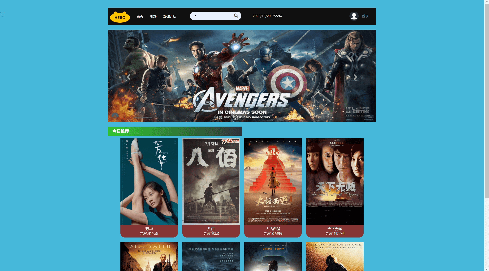
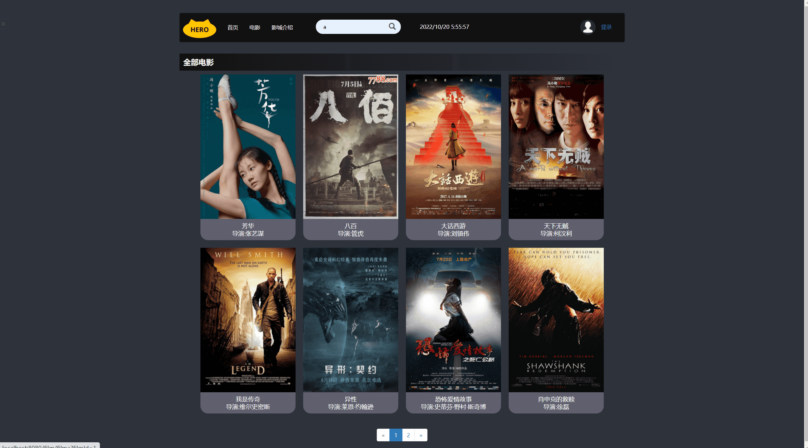
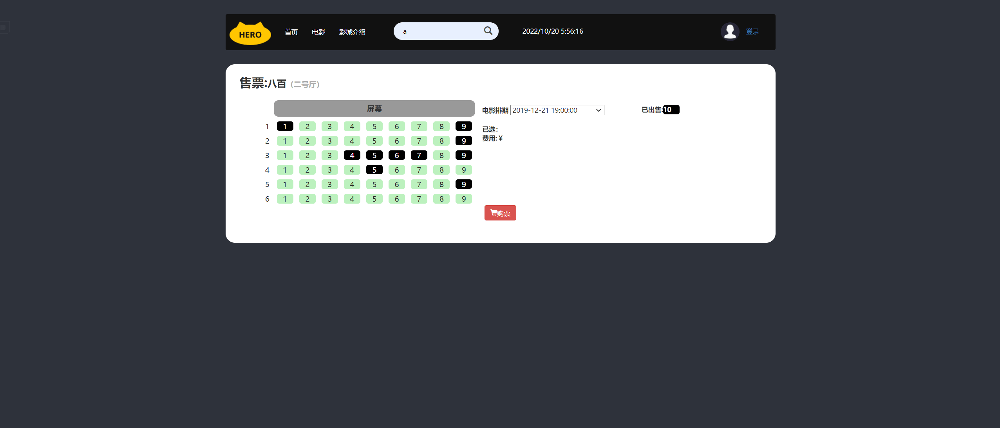
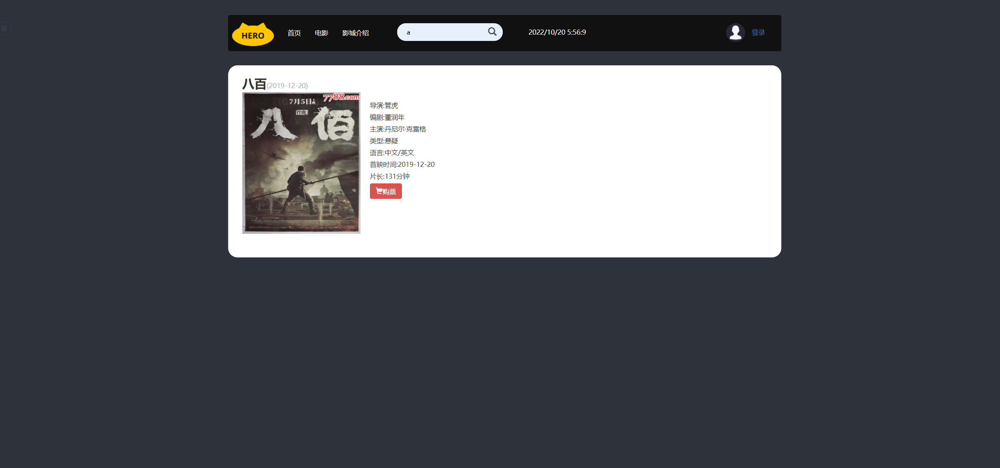
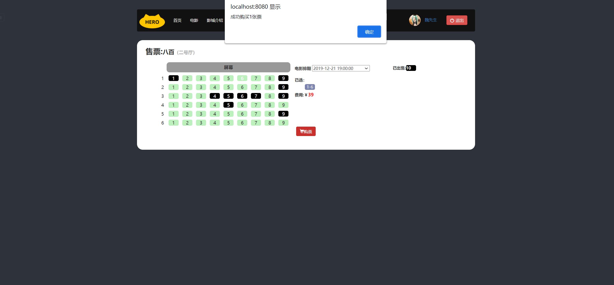
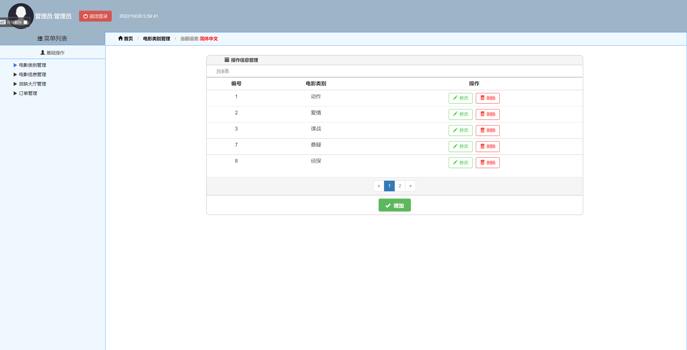
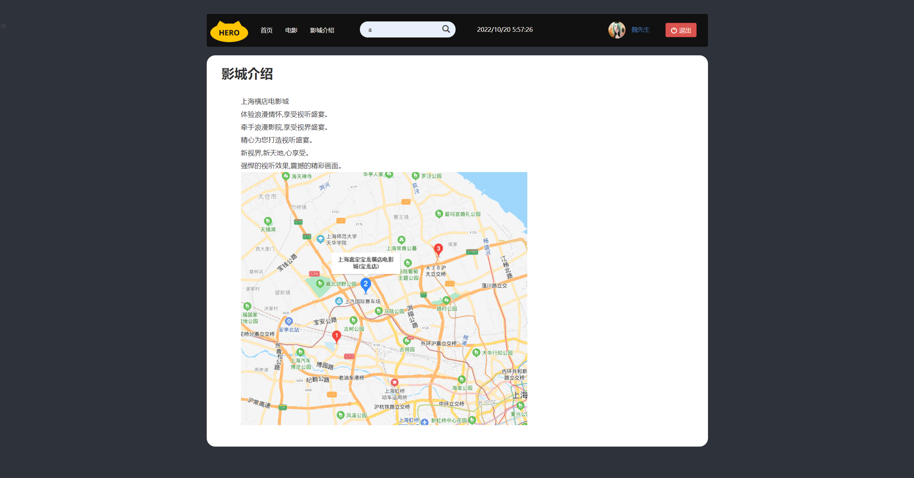

基于SSM的电影选票系统
=
### 完整代码获取地址：从戎源码网 ([https://armycodes.com/](https://armycodes.com/))
### 作者微信：19941326836  QQ：952045282 
### 承接计算机毕业设计、Java毕业设计、Python毕业设计、深度学习、机器学习
### 选题+开题报告+任务书+程序定制+安装调试+论文+答辩ppt 一条龙服务
### 所有选题地址https://github.com/nature924/allProject

一、项目介绍
---
基于SSM框架的电影选票系统，有用户和管理员两个角色，主要功能如下
### 

用户功能模块：
1. 电影浏览：用户可以浏览系统上的电影信息，包括电影名称、剧情简介、演员等。
2. 影城介绍：用户可以查看影城的详细信息，包括地址、联系方式、放映大厅数量等。
3. 电影购票：用户可以选择感兴趣的电影，选择放映时间和日期，并购买电影选票。
4. 购票选座：用户可以在选座界面中选择座位，并查看实时的座位情况，以便做出选择。

###
管理员功能模块：
1. 电影类别管理：管理员可以添加、编辑、删除电影的类别信息，如喜剧、动作、爱情等。
2. 电影信息管理：管理员可以添加、编辑、删除电影的详细信息，包括电影名称、上映时间、导演等。
3. 放映大厅管理：管理员可以管理放映大厅的信息，包括大厅名称、座位数量、座位安排等。
4. 订单管理：管理员可以查看和管理用户的订单信息，包括购票时间、购票数量、座位号等。

二、项目技术
---
- 编程语言：Java
- 数据库：MySQL
- 项目管理工具：Maven
- 前端技术：JSP、HTML、Jquery、Layui、ECharts
- 后端技术：Spring、SpringMVC、MyBatis

三、运行环境
---
- 操作系统：Windows、macOS都可以
- JDK版本：JDK1.8以上都可以
- 开发工具：IDEA、Ecplise、Myecplise都可以
- 数据库: MySQL5.7以上都可以
- Tomcat：任意版本都可以
- Maven：任意版本都可以

四、运行截图
---

### 程序截图：

